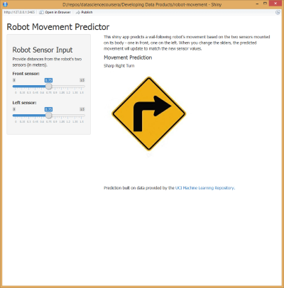

## Wall-Following Robots

- Wall-following robots use sonar-enabled sensors to navigate complex spaces by sticking close to one or more of the walls. The hardware platforms the robots are built on can often be expensive, and high-quality sensors are more expensive than that.
- Failure of a decision predictor could mean damaging the robot, at high cost!
- How can we test a predictor without damaging the robot?
- One way is to build an application which allows the predictor to be "manually" tested. Ideally many people could be testing at once, which suggests a web application.
- With Shiny, we can build a webapp around the predictor with little extra effort, and allow the predictor to be tested.

--- .class #id 

## Building A Predictor

```{r, echo=FALSE, message=FALSE, warning=FALSE, results='hide'}
library(caret)
library(randomForest)
set.seed(123454321)
```

Predictors for testing can be built using the `caret` library, training on whatever data the developer feels is necessary. For demonstration purposes we can get robot data from the [UCI Machine Learning Repository](http://archive.ics.uci.edu/ml/datasets/Wall-Following+Robot+Navigation+Data). With that data, we can build a data frame, and our training, and test sets.

```{r}
sensor_data <- read.csv('sensor_readings_4.data', header=FALSE)
names(sensor_data) <- c('SD_front', 'SD_left', 'SD_right', 'SD_back', 'class')

# Build training/test sets
inTrain <- createDataPartition(y = sensor_data$class, p=0.6, list=F)
training <- sensor_data[inTrain,]
testing <- sensor_data[-inTrain,]
```

---

## Initial Predictor

With that we can train the predictor and look at the OOB confusion matrix.

```{r}
model <- randomForest(class ~ ., data = training)
pred <- predict(model, testing)
confusionMatrix(pred, testing$class)$overall
```

---

## The Application

With the model in place, a Shiny application can be built around it that provides quick prediction feedback from many users without the risk of damaging a robot.



